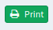
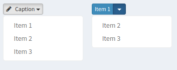

# Netlte > ActionBar

## Install

```
composer require netlte/actionbar
```

## Tests

Check code quality and run tests
```
composer build
```

or separately

```
composer cs
composer analyse
composer tests
```

## Usage

### Template
Default templates supports `Nette\Localization\Translator` for translating captions and can be overridden for global scope by changing static template path in `\Netlte\ActionBar\<COMPONENT_NAME>::$DEFAULT_TEMPLATE` or dynamically in runtime by
```php
/** @var \Netlte\UI\AbstractControl $control */
$control->setTemplateFile('/path/to/yours/template.latte');
```

## Actions
There are two type of actions. Button and DropDown. Both react on click and can be stylised as you want. They can be used alone but main purpose is panel's header bar 

#### Properties
* **caption** - Text describing action
* **icon** - Icon describing action
* **target** - Define how should be action called same way as HTML anchor `<a>` target attribute. See `\Netlte\ActionBar\AbstractAction::TARGET_*` constants.
* **title** - Html title attribute.
* **size** - Action size. See `\Netlte\ActionBar\AbstractAction::SIZE_*` constants.
* **color** - Action color
* **ajax** - Disable/Enable calling action over ajax
* **disabled** - Disable/Enable whole action

### Button
`\Netlte\ActionBar\Button` have no special properties extending `\Netlte\ActionBar\AbstractAction` only **onClick** event.

#### Example
```php
<?php

use Netlte\ActionBar\Button;

$button = new Button('Print');
$button
    ->setColor('success')
    ->setIcon('print')
    ->setSize(Button::SIZE_SM)
    ->setTitle('Will print this page')
    ->onClick[] = function(Button $sender) {
        // $this->print();
    };

```


### DropDown
`Netlte\ActionBar\DropDown` is same as `Netlte\ActionBar\Button` but you can define more action in one. It have `onSelect` event instead of `onClick` event. This event sends action name as string and `DropDown` instance. If you not define `caption` then first action is used.

#### Properties

* **items** - subactions

#### Example
```php
<?php

use Netlte\ActionBar\DropDown;

$dropdown = new DropDown('Caption');
$dropdown
    ->setColor('default')
    ->setIcon('pencil')
    ->setSize(DropDown::SIZE_XS)
    ->addItem('1', 'Item 1')
    ->addItem('2', 'Item 2')
    ->addItem('3', 'Item 3')
    ->onSelect[] = function(DropDown $sender, string $item) {
        switch($item){
            // do something ...
        }
    };
    
// OR !!!

$dropdown
    ->setCaption(null)
    ->setColor('primary');


```


### ActionBar
`Netlte\ActionBar\ActionBar` is factory and wrapper for actions. It's standard Nette control.

#### Example
```php
<?php

$actionbar = new Netlte\ActionBar\ActionBar();

$actionbar->addButton(
    'lg_button',
    'Awesome button !!!',
    'pencil',
    "Awesome ajax button's title",
    Netlte\ActionBar\AbstractAction::SIZE_XS,
    'success',
    true
)->setTranslator($this->getTranslator());

$actionbar->addButton(
    'disabled_button',
    'Awesome button !!!',
    'pencil',
    "Awesome ajax button's title",
    Netlte\ActionBar\AbstractAction::SIZE_XS,
    'warning',
    true
)
    ->setDisabled(true)
    ->setTranslator($this->getTranslator());

$actionbar->addDropDown(
    'dropdown',
    'Awesome dropdown !!!',
    'user',
    "Awesome dropdown's title",
    Netlte\ActionBar\AbstractAction::SIZE_XS,
    'primary',
    true
);
```


## Development

More examples are in [tests](../tests/) or in [sandbox](https://github.com/Netlte/Sandbox) project app.
