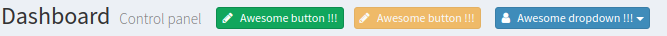

# Netlte > ActionBar

[](https://travis-ci.com/Netlte/ActionBar)
[](https://packagist.org/packages/Netlte/ActionBar)
[](https://packagist.org/packages/Netlte/ActionBar)
[](https://packagist.org/packages/Netlte/ActionBar)
[](https://packagist.org/packages/Netlte/ActionBar)
[](https://github.com/phpstan/phpstan)

## Credits

Feel free to use. Your contributions are very welcome. Feel free to publish pull requests.

## Overview

GUI Component for header actions (Buttons & DropDowns)



## Install

```
composer require netlte/actionbar
```
## Documentation
You can find more info in [.docs](.docs/) folder.

## Versions

| State       | AdminLTE | Version | Branch   | PHP      |
|-------------|----------|---------|----------|----------|
| stable      |   `2.0`  | `^1.0`  |  `main`  | `>= 7.4` |
| NoN         |   `3.0`  | `^2.0`  |  `main`  | `>= 8.0` |


## Tests

Check code quality and run tests
```
composer build
```

or separately

```
composer cs
composer analyse
composer tests
```

## Authors

| [Tomáš Holan](https://github.com/holantomas)                             |
|--------------------------------------------------------------------------|
|         |


